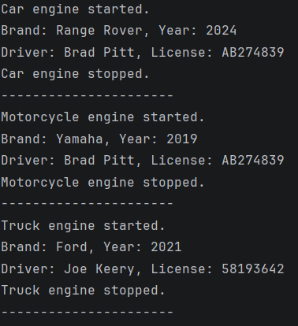

# Vehicle Management System

## Project Overview
This project demonstrates Object-Oriented Programming concepts in Java,
including inheritance, abstraction, composition, aggregation, and method overriding.
A vehicle management system was implemented using an abstract Vehicle class
and several concrete subclasses.

## Class Hierarchy
- Vehicle (abstract superclass)
    - Car
    - Motorcycle
    - Truck

The Vehicle class defines abstract methods `startEngine()` and `stopEngine()`,
which are overridden in each subclass to provide specific behavior.

Protected fields are used to allow subclass access while maintaining encapsulation.

## Composition and Aggregation
Each Vehicle has a Driver object (composition).
One Driver can be associated with multiple Vehicle objects (aggregation).

## How to Compile and Run

```bash
javac *.java
java Main
```



## Reflection
Inheritance simplified the design by allowing common vehicle attributes
and behaviors to be defined in a single abstract superclass.
Method overriding enabled each vehicle type to implement custom engine behavior
while preserving a unified interface.

The main challenge was selecting appropriate access modifiers.
Using protected fields allowed subclasses to access shared data without
exposing it publicly, balancing flexibility and encapsulation.